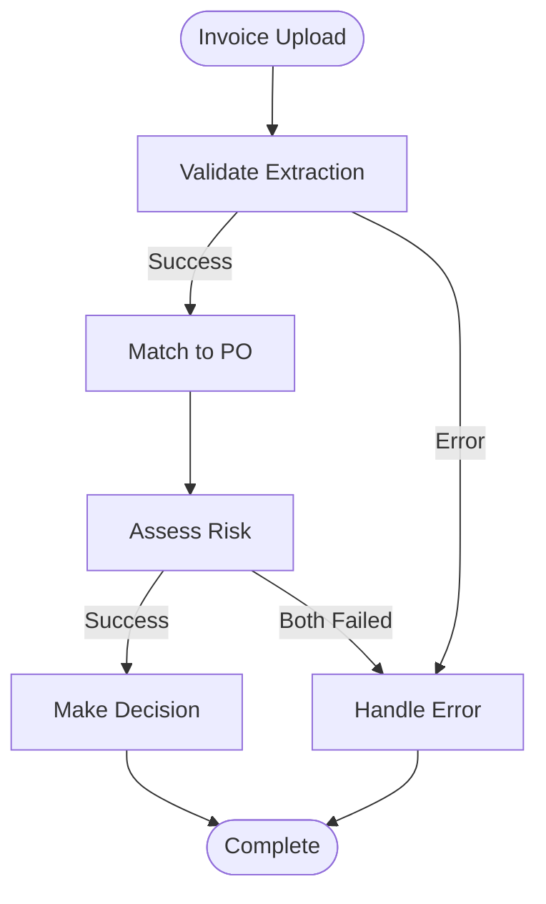

# SmartAP Backend - Phase 1 & 2

Intelligent Invoice & Accounts Payable Automation Hub

## Overview

### Phase 1: Core Intake Engine ✅
Converts unstructured PDF invoices into structured data using AI-powered extraction.

### Phase 2: Multi-Agent Reasoning System 🚧
Intelligent PO matching, fraud detection, and risk assessment with orchestrated AI agents.

### Features

**Phase 1 - Extraction:**
- 📄 **PDF Upload**: Accept digital and scanned invoice PDFs
- 🔍 **Text Extraction**: Extract text from PDFs (OCR placeholder for Foxit integration)
- 🤖 **AI Extraction**: Zero-shot invoice data extraction using LLM
- ✅ **Confidence Scoring**: Per-field confidence scores for validation
- 🔄 **Validation**: Self-consistency checks (line items vs totals)

**Phase 2 - Matching & Risk:**
- 🎯 **PO Matching**: Algorithmic + AI-powered invoice-to-PO matching (Sub-Phase 2.2 ✅)
- 🔍 **Discrepancy Detection**: Automatic detection of mismatches (vendor, amount, line items, dates) ✅
- ⚠️ **Risk Assessment**: Duplicate detection, vendor risk scoring, price anomalies (Sub-Phase 2.3 ✅)
- 🚨 **Fraud Detection**: Multi-strategy duplicate checking, pattern analysis ✅
- 🤝 **Vendor Validation**: Track vendor history, payment patterns, risk profiles ✅
- 🔀 **Workflow Orchestration**: LangGraph-based multi-agent coordination (Sub-Phase 2.4 ✅)
- 📊 **Database Layer**: SQLAlchemy async with PostgreSQL/SQLite support ✅

## Tech Stack

- **Backend**: Python + FastAPI + SQLAlchemy 2.0
- **AI Framework**: Microsoft Agent Framework (preview)
- **LLM**: OpenAI GPT-4.1 via GitHub Models (free tier)
- **PDF Processing**: pypdf (placeholder for Foxit SDK)
- **Database**: SQLite (dev) / PostgreSQL (production)
- **Matching**: Fuzzy matching with fuzzywuzzy + custom scoring algorithms

## Quick Start

### Prerequisites

- Python 3.11+
- GitHub account (for GitHub Models free tier)

### Installation

1. **Create virtual environment**:
   ```bash
   cd backend
   python -m venv venv
   .\venv\Scripts\Activate.ps1  # Windows PowerShell
   # or: source venv/bin/activate  # Linux/Mac
   ```

2. **Install dependencies** (note: `--pre` flag required for Agent Framework):
   ```bash
   pip install -r requirements.txt --pre
   ```

3. **Configure environment**:
   ```bash
   cp .env.example .env
   # Edit .env with your settings
   ```

4. **Get GitHub Token**:
   - Go to https://github.com/settings/tokens
   - Create a new token with `repo` scope
   - Add to `.env` as `GITHUB_TOKEN`

5. **Run the server**:
   ```bash
   uvicorn src.main:app --reload
   ```

6. **Open API docs**:
   - Swagger UI: http://localhost:8000/docs
   - ReDoc: http://localhost:8000/redoc

## API Endpoints

### Upload Invoice

```bash
POST /api/v1/invoices/upload
Content-Type: multipart/form-data

# Example using curl:
curl -X POST "http://localhost:8000/api/v1/invoices/upload" \
  -H "accept: application/json" \
  -F "file=@invoice.pdf"
```

### Response

```json
{
  "document_id": "uuid",
  "file_name": "invoice.pdf",
  "file_hash": "sha256...",
  "status": "extracted",
  "invoice": {
    "invoice_number": "INV-2025-001",
    "vendor_name": "ABC Supplies",
    "invoice_date": "2025-01-15",
    "total": 1500.00,
    "line_items": [...]
  },
  "confidence": {
    "invoice_number": 0.95,
    "vendor_name": 0.92,
    "total": 0.98,
    "overall": 0.93
  },
  "requires_review": false,
  "extraction_time_ms": 2500
}
```

### Phase 2: Match Invoice to PO

```bash
POST /api/v1/invoices/{document_id}/match?use_ai=true
```

**Response:**
```json
{
  "invoice_id": "INV-2025-001",
  "po_number": "PO-2025-001",
  "matching_id": "uuid...",
  "match_type": "exact",
  "match_score": 0.96,
  "matched": true,
  "vendor_match_score": 1.0,
  "amount_match_score": 0.98,
  "line_items_match_score": 0.94,
  "discrepancies": [
    {
      "type": "amount_mismatch",
      "severity": "minor",
      "description": "Invoice amount over PO by $20.00 (1.8%)",
      "invoice_value": "$1120.00",
      "po_value": "$1100.00"
    }
  ],
  "requires_approval": false,
  "matched_by": "po_matching_agent"
}
```

### Phase 2.3: Assess Invoice Risk

```bash
POST /api/v1/invoices/{document_id}/assess-risk?vendor_id=V001
```

**Response:**
```json
{
  "invoice_id": "INV-2025-001",
  "assessment_id": "uuid...",
  "risk_level": "medium",
  "risk_score": 0.42,
  "duplicate_risk_score": 0.0,
  "vendor_risk_score": 0.15,
  "price_risk_score": 0.70,
  "amount_risk_score": 0.20,
  "pattern_risk_score": 0.0,
  "risk_flags": [
    {
      "flag_type": "price_anomaly",
      "severity": "high",
      "description": "Price anomaly: +85.2% from average ($1200.00)",
      "confidence": 0.85
    }
  ],
  "critical_flags": 0,
  "high_flags": 1,
  "recommended_action": "review",
  "action_reason": "Medium risk level - manual review recommended",
  "requires_manual_review": true,
  "assessed_by": "risk_detection_agent"
}
```

### Phase 2.4: Process Invoice (Complete Workflow)

```bash
POST /api/v1/invoices/{document_id}/process?vendor_id=V001
```

This endpoint orchestrates the complete invoice processing workflow:
1. **Validates Extraction**: Ensures invoice has been successfully extracted
2. **Matches to PO**: Finds matching purchase order with AI assistance
3. **Assesses Risk**: Detects duplicates, vendor risk, and price anomalies
4. **Makes Decision**: Auto-approves, requires review, or rejects invoice

**Response:**
```json
{
  "document_id": "DOC-001",
  "status": "completed",
  "decision": "auto_approved",
  "decision_reason": "High match score (0.96) and low risk",
  "requires_manual_review": false,
  "recommended_actions": ["Proceed with payment"],
  
  "extraction": {
    "completed": true,
    "confidence": 0.95,
    "invoice_data": {
      "invoice_number": "INV-12345",
      "invoice_date": "2026-01-05",
      "total_amount": 1000.00,
      "vendor_name": "Tech Supplies Inc",
      "po_number": "PO-001"
    },
    "error": null
  },
  
  "matching": {
    "completed": true,
    "match_score": 0.96,
    "match_type": "exact",
    "discrepancies_count": 0,
    "discrepancies": [],
    "error": null
  },
  
  "risk": {
    "completed": true,
    "risk_level": "low",
    "risk_score": 0.15,
    "is_duplicate": false,
    "flags_count": 0,
    "risk_flags": [],
    "error": null
  },
  
  "metadata": {
    "started_at": "2026-01-07T10:00:00Z",
    "completed_at": "2026-01-07T10:00:04Z",
    "processing_time_ms": 4200,
    "ai_calls_made": 1,
    "errors": []
  }
}
```

**Decision Types:**
- `auto_approved`: Invoice approved automatically (high match, low risk)
- `requires_review`: Manual review needed (medium risk or discrepancies)
- `requires_investigation`: High risk factors detected
- `escalated`: Critical issues requiring senior management review
- `rejected`: Duplicate or critical risk factors

**Additional Endpoints:**

```bash
# Get current processing status
GET /api/v1/invoices/{document_id}/status

# Reprocess an invoice (useful for failed/rejected invoices)
POST /api/v1/invoices/{document_id}/reprocess?vendor_id=V001
```

### Health Check

```bash
GET /api/v1/health
```

## Phase 2 Usage - Database Seeding

### Initialize Database with Test Data

```bash
# Create database tables and seed with test data
python -m src.db.seed
```

This creates:
- 10 vendors with varying risk profiles
- 20 purchase orders (open, partial, closed)
- SQLite database: `smartap.db`

### Run Tests

```bash
# Install test dependencies
pip install pytest pytest-asyncio

# Run all tests
pytest

# Run specific test file
pytest tests/test_repositories.py -v
pytest tests/test_matching_service.py -v
pytest tests/test_risk_detection.py -v
```

## Workflow Example

### Complete Invoice Processing Flow

**Option 1: Step-by-Step Processing**

```bash
# 1. Upload invoice (Phase 1)
curl -X POST "http://localhost:8000/api/v1/invoices/upload" \
  -F "file=@invoice.pdf"
# Returns: {"document_id": "DOC-123", "invoice": {...}, "status": "extracted"}

# 2. Match to PO (Phase 2.2)
curl -X POST "http://localhost:8000/api/v1/invoices/DOC-123/match?use_ai=true"
# Returns: {"match_score": 0.96, "discrepancies": [...], "requires_approval": false}

# 3. Assess risk (Phase 2.3)
curl -X POST "http://localhost:8000/api/v1/invoices/DOC-123/assess-risk?vendor_id=V001"
# Returns: {"risk_level": "low", "recommended_action": "approve"}
```

**Option 2: Orchestrated Workflow (Recommended)**

```bash
# 1. Upload invoice
curl -X POST "http://localhost:8000/api/v1/invoices/upload" \
  -F "file=@invoice.pdf"
# Returns: {"document_id": "DOC-123", ...}

# 2. Process through complete workflow (Phase 2.4)
curl -X POST "http://localhost:8000/api/v1/invoices/DOC-123/process?vendor_id=V001"
# Returns: Complete workflow result with decision (auto_approved/requires_review/rejected)

# This single endpoint:
# - Validates extraction
# - Matches to PO with AI
# - Assesses all risk factors
# - Makes approval decision
# - Returns comprehensive results
```

**Workflow State Machine:**

```
┌─────────────┐
│   Upload    │
│  Invoice    │
└──────┬──────┘
       │
       ▼
┌─────────────┐
│  Validate   │
│ Extraction  │
└──────┬──────┘
       │
       ▼
┌─────────────┐
│  Match to   │
│     PO      │
└──────┬──────┘
       │
       ▼
┌─────────────┐
│   Assess    │
│    Risk     │
└──────┬──────┘
       │
       ▼
┌─────────────┐
│    Make     │
│  Decision   │
└──────┬──────┘
       │
       ▼
┌─────────────────────────────────┐
│ auto_approved / requires_review │
│   escalated / rejected          │
└─────────────────────────────────┘
```

## Project Structure

```
backend/
├── src/
│   ├── __init__.py
│   ├── config.py              # Environment settings
│   ├── main.py                # FastAPI application
│   ├── api/
│   │   ├── __init__.py
│   │   └── routes.py          # API endpoints (extraction, matching, risk, orchestration)
│   ├── models/
│   │   ├── __init__.py
│   │   ├── invoice.py         # Invoice data models
│   │   ├── purchase_order.py  # PO data models (Phase 2)
│   │   ├── vendor.py          # Vendor & risk models (Phase 2)
│   │   ├── matching.py        # Matching result models (Phase 2)
│   │   └── risk.py            # Risk assessment models (Phase 2)
│   ├── services/
│   │   ├── __init__.py
│   │   ├── ocr_service.py              # PDF text extraction
│   │   ├── extraction_agent.py         # AI extraction agent
│   │   ├── matching_service.py         # Scoring algorithms (Phase 2.2)
│   │   ├── discrepancy_detector.py     # Discrepancy detection (Phase 2.2)
│   │   ├── duplicate_detector.py       # Duplicate detection (Phase 2.3)
│   │   ├── vendor_risk_analyzer.py     # Vendor risk analysis (Phase 2.3)
│   │   └── price_anomaly_detector.py   # Price anomaly detection (Phase 2.3)
│   ├── agents/
│   │   ├── __init__.py
│   │   ├── po_matching_agent.py        # PO matching agent (Phase 2.2)
│   │   └── risk_detection_agent.py     # Risk detection agent (Phase 2.3)
│   ├── orchestration/
│   │   ├── __init__.py
│   │   ├── workflow_state.py           # LangGraph state schema (Phase 2.4)
│   │   ├── workflow_nodes.py           # Workflow node functions (Phase 2.4)
│   │   ├── workflow_graph.py           # LangGraph state machine (Phase 2.4)
│   │   └── orchestrator.py             # Main orchestrator (Phase 2.4)
│   └── db/
│       ├── __init__.py
│       ├── database.py        # SQLAlchemy engine & session (Phase 2)
│       ├── models.py          # ORM models (Phase 2)
│       ├── repositories.py    # Data access layer (Phase 2)
│       ├── seed_data.py       # Test data (Phase 2)
│       └── seed.py            # Seeding CLI (Phase 2)
├── tests/
│   ├── test_repositories.py       # Database tests (Phase 2.1)
│   ├── test_matching_service.py   # Matching tests (Phase 2.2)
│   ├── test_risk_detection.py     # Risk detection tests (Phase 2.3)
│   └── test_orchestration.py      # Orchestration tests (Phase 2.4)
├── requirements.txt
├── .env.example
└── README.md
```

## Configuration Options

| Variable | Description | Default |
|----------|-------------|---------|
| `AI_PROVIDER` | AI provider: github, openai, azure | `github` |
| `GITHUB_TOKEN` | GitHub PAT for GitHub Models | - |
| `MODEL_ID` | Model to use for extraction | `openai/gpt-4.1` |
| `EXTRACTION_CONFIDENCE_THRESHOLD` | Min confidence for auto-approval | `0.85` |
| `MAX_FILE_SIZE_MB` | Maximum upload file size | `50` |
| `DATABASE_URL` | Database connection string | `sqlite+aiosqlite:///./smartap.db` |

## Foxit OCR Integration (Placeholder)

The OCR service is prepared for Foxit Maestro OCR SDK integration. Currently uses pypdf as a fallback for digital PDFs.

To enable Foxit OCR:
1. Set `FOXIT_API_KEY` and `FOXIT_API_ENDPOINT` in `.env`
2. Implement `_process_with_foxit()` in `ocr_service.py`

## Architecture: Multi-Agent Orchestration

### LangGraph Workflow

SmartAP uses LangGraph for stateful multi-agent orchestration. The workflow coordinates three specialized agents:

1. **Extraction Agent** (Phase 1): Extracts structured data from PDF invoices
2. **PO Matching Agent** (Phase 2.2): Matches invoices to purchase orders with AI assistance
3. **Risk Detection Agent** (Phase 2.3): Detects duplicates, vendor risk, and price anomalies

### Workflow State Machine



### State Schema

The workflow maintains a comprehensive state object tracking:
- **Extraction**: Invoice data, confidence scores, errors
- **Matching**: Match scores, discrepancies, PO details
- **Risk**: Risk levels, flags, duplicate detection
- **Decision**: Final approval status, recommended actions
- **Metadata**: Processing time, AI calls, error tracking

### Decision Logic

| Condition | Decision | Action |
|-----------|----------|--------|
| Critical risk OR 2+ critical flags | `rejected` | Block payment |
| 1 critical flag | `escalated` | Senior review |
| High risk OR 2+ high flags | `requires_investigation` | Investigate |
| Critical discrepancies OR low match | `requires_review` | Manual review |
| Match ≥95% AND risk = low | `auto_approved` | Process payment |
| Default | `requires_review` | Manual review |

## Next Steps (Phase 2.5+)

**Sub-Phase 2.5: API & Testing** ✅ (Week 7)
- ✅ Integration tests for complete workflows (`tests/test_integration.py`)
- ✅ End-to-end API tests (`tests/test_api_e2e.py`)
- ✅ Performance testing & load testing (`tests/test_performance.py`)
- ✅ Enhanced API documentation (OpenAPI/Swagger with examples)
- ✅ Test infrastructure with fixtures and utilities (`tests/conftest.py`)
- ✅ Pytest configuration and Postman collection

**Sub-Phase 2.6: Performance & Deployment** (Week 8)
- [ ] Caching layer for vendor/PO data
- [ ] Database query optimization
- [ ] Docker containerization
- [ ] Kubernetes deployment manifests
- [ ] Production deployment guide

## Testing Guide

### Test Structure

SmartAP includes comprehensive test coverage across multiple levels:

**Test Files:**
- `tests/conftest.py` - Test fixtures, utilities, and helpers (424 lines)
- `tests/test_integration.py` - Integration tests with database (467 lines, 13 tests)
- `tests/test_api_e2e.py` - End-to-end HTTP API tests (352 lines, 11 tests)
- `tests/test_performance.py` - Performance benchmarks and load tests (429 lines, 8 tests)

**Test Categories:**
- **Unit Tests** - Fast, isolated tests for individual components
- **Integration Tests** - Tests with real database transactions
- **E2E Tests** - HTTP-level API tests with FastAPI TestClient
- **Performance Tests** - Response time benchmarks
- **Load Tests** - Concurrent request handling
- **Stress Tests** - Extreme scenarios (many line items, rapid requests)

### Running Tests

**Install test dependencies:**
```bash
pip install pytest pytest-asyncio
```

**Run all tests:**
```bash
pytest
```

**Run specific test categories:**
```bash
# Run only integration tests
pytest -m integration

# Run only E2E API tests
pytest -m e2e

# Run only performance tests
pytest -m performance

# Run only load tests
pytest -m load

# Run only stress tests
pytest -m stress

# Run smoke tests (quick validation)
pytest -m smoke

# Run all benchmarks
pytest -m benchmark
```

**Run specific test file:**
```bash
# Integration tests
pytest tests/test_integration.py -v

# E2E API tests
pytest tests/test_api_e2e.py -v

# Performance tests
pytest tests/test_performance.py -v

# With detailed output
pytest tests/test_integration.py -vv --showlocals
```

**Run specific test:**
```bash
# Run single test method
pytest tests/test_integration.py::TestUploadMatchAssessWorkflow::test_happy_path_workflow -v

# Run test class
pytest tests/test_integration.py::TestOrchestratedWorkflow -v
```

### Test Fixtures

SmartAP provides reusable fixtures for testing (defined in `conftest.py`):

**Database Fixtures:**
```python
# In-memory test database with clean state
@pytest.fixture
async def test_db_session():
    # Provides AsyncSession with automatic cleanup
    pass

# Sample data fixtures
@pytest.fixture
def sample_vendor_data():
    # Returns vendor dict with realistic values
    pass

@pytest.fixture
async def sample_vendor(test_db_session):
    # Creates and returns actual Vendor DB record
    pass
```

**Test Client:**
```python
@pytest.fixture
def test_client(test_db_session):
    # FastAPI TestClient with test database injected
    pass
```

**Data Builders:**
```python
@pytest.fixture
def test_data_builder(test_db_session):
    # Fluent API for building complex test scenarios
    # Example:
    builder = TestDataBuilder(session)
    vendor = await builder.create_vendor(vendor_id="V001", vendor_name="Test Corp")
    po = await builder.create_po(po_number="PO-001", vendor_id="V001", amount=1000.00)
    invoice = await builder.create_invoice(document_id="DOC-001", po_number="PO-001")
    await builder.commit()  # Saves all to database
```

**Assertion Helpers:**
```python
# Validate invoice data structure
assert_invoice_match(invoice_data, expected_invoice_number="INV-001")

# Validate matching result
assert_matching_result(result, min_score=0.90, match_type="exact")

# Validate risk assessment
assert_risk_assessment(assessment, max_risk_level="low", is_duplicate=False)

# Validate workflow completion
assert_workflow_completed(state, expected_status="completed", expected_decision="auto_approved")
```

### Performance Benchmarks

**Response Time Expectations:**
- **Matching**: Average <2000ms, Max <5000ms
- **Risk Assessment**: Average <1500ms
- **Orchestration**: Average <8000ms

**Load Capacity:**
- **Concurrent Matching**: 20 requests, ≥18 successful, <3000ms average
- **Concurrent Orchestration**: 10 requests, 5 workers, consistent decisions

**Stress Tests:**
- **Many Line Items**: 50 PO line items processed in <5000ms
- **Rapid Sequential**: 100 status checks, average <100ms, max <500ms

**Run performance tests:**
```bash
# Run all performance tests
pytest -m performance -v

# Run with detailed timing
pytest tests/test_performance.py::TestResponseTimes -v

# Run load tests
pytest -m load -v

# Run stress tests
pytest -m stress -v
```

### Test Configuration

**Pytest Configuration** (`pytest.ini`):
- Asyncio mode: `auto` (automatic async test detection)
- Test discovery: `test_*.py`, `Test*` classes, `test_*` functions
- Markers: `unit`, `integration`, `e2e`, `performance`, `load`, `stress`, `benchmark`, `smoke`
- Verbose output with local variables and captured output
- Log files: `tests/pytest.log`

**Environment Variables for Testing:**
```bash
# Use in-memory SQLite for fast tests
DATABASE_URL=sqlite+aiosqlite:///:memory:

# Disable AI for faster tests (use algorithmic matching)
AI_PROVIDER=mock
```

### Postman Collection

Import `SmartAP.postman_collection.json` into Postman for manual API testing.

**Collection Features:**
- All API endpoints with examples
- Auto-extraction of `document_id` from responses
- Environment variables (`baseUrl`, `document_id`, `vendor_id`)
- Pre-configured requests for typical workflows
- Test scripts for response validation

**Quick Start:**
1. Import collection: `File > Import > SmartAP.postman_collection.json`
2. Update `baseUrl` variable if needed (default: `http://localhost:8000`)
3. Run requests in order for typical workflow:
   - Health Check
   - Upload Invoice (gets `document_id`)
   - Process Invoice (complete workflow)
   - Get Status

**Typical Workflow in Postman:**
```
1. Health Check → Verify API is running
2. Upload Invoice → Returns document_id (auto-saved)
3. Process Invoice → Complete orchestration (uses saved document_id)
4. Get Status → Check processing progress
```

### Coverage Reporting

**Generate coverage report:**
```bash
# Install coverage tool
pip install pytest-cov

# Run tests with coverage
pytest --cov=src --cov-report=term-missing --cov-report=html

# View HTML report
# Open htmlcov/index.html in browser
```

### Continuous Integration

**GitHub Actions** (example):
```yaml
name: Tests
on: [push, pull_request]
jobs:
  test:
    runs-on: ubuntu-latest
    steps:
      - uses: actions/checkout@v3
      - name: Set up Python
        uses: actions/setup-python@v4
        with:
          python-version: '3.11'
      - name: Install dependencies
        run: |
          pip install -r requirements.txt --pre
          pip install pytest pytest-asyncio
      - name: Run smoke tests
        run: pytest -m smoke -v
      - name: Run integration tests
        run: pytest -m integration -v
      - name: Run E2E tests
        run: pytest -m e2e -v
```

### Debugging Tests

**Run with debugger:**
```bash
# Run with pdb on failure
pytest --pdb

# Run with pdb on first failure
pytest -x --pdb
```

**Verbose logging:**
```bash
# Enable console logging
pytest --log-cli-level=DEBUG

# Show captured stdout
pytest -s
```

**Run single test with full context:**
```bash
pytest tests/test_integration.py::test_happy_path_workflow -vv --showlocals --tb=long
```

## License

MIT
