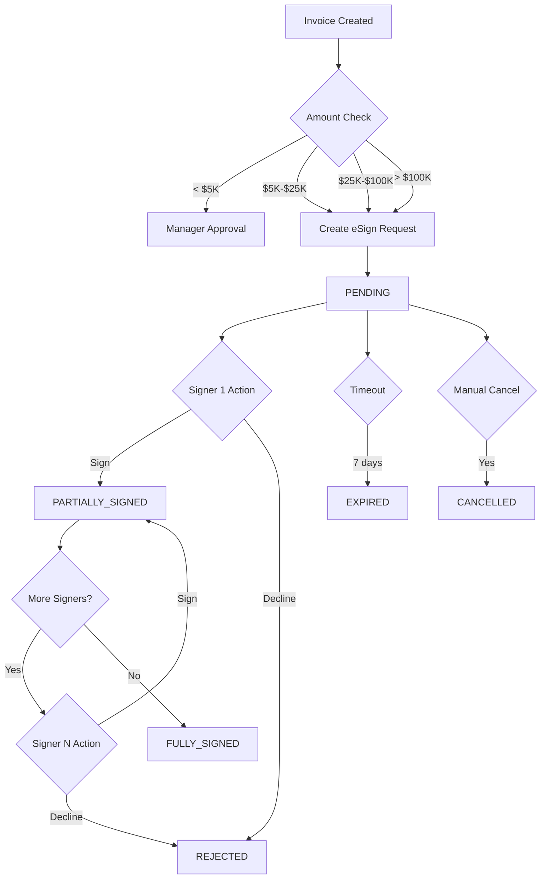

# Phase 4.2 Implementation Summary: Foxit eSign Integration

**Status:** Backend Complete ✅ | Frontend Components Created ✅ | Integration Ready for Testing ⏳  
**Date:** January 2025  
**Phase:** 4.2 - Electronic Signature Workflow

---

## Overview

Phase 4.2 implements threshold-based electronic signature workflow for high-value invoice approvals using Foxit eSign API. This feature ensures compliance with financial controls and creates audit trails for all approval actions.

### Key Features Implemented

- **Threshold-Based Routing**: Automatic routing based on invoice amount
  - < $5,000: Manager approval (no eSign)
  - $5,000 - $25,000: Senior Manager eSign
  - $25,000 - $100,000: CFO eSign
  - > $100,000: CFO + Controller eSign (sequential)

- **Secure API Integration**: HMAC-SHA256 authentication for all Foxit API calls
- **Webhook Handling**: Real-time status updates from Foxit eSign
- **Audit Trail**: Complete logging of all signature events
- **Sequential Signing**: Enforced signing order for multi-approver workflows
- **Reminder System**: Automated and manual reminder emails
- **Document Management**: Secure storage and retrieval of signed documents

---

## Implementation Details

### Backend Components (3 files, ~1,000 lines)

#### 1. **ESign Service** (`backend/src/services/esign_service.py`)

**Purpose:** Core service for Foxit eSign API integration  
**Lines of Code:** 450  
**Key Features:**

- **Authentication:** HMAC-SHA256 signature generation for API requests
- **Webhook Security:** Signature verification for incoming webhooks
- **Request Management:** Create, check status, cancel, send reminders
- **Document Handling:** Upload PDFs, download signed documents
- **Event Processing:** Handle signed, declined, completed, expired events

**Main Classes:**
```python
class ESignService:
    - create_signing_request(invoice_id, document_path, signers) → request_id
    - check_signing_status(request_id) → status
    - download_signed_document(request_id, output_path) → file_path
    - cancel_signing_request(request_id, reason) → success
    - send_reminder(request_id, signer_email) → success
    - handle_webhook(event_type, payload) → processed_event
    - verify_webhook_signature(signature, body) → bool

class ESignStatus(Enum):
    PENDING, PARTIALLY_SIGNED, FULLY_SIGNED, REJECTED, EXPIRED, CANCELLED

class SignerRole(Enum):
    MANAGER, SENIOR_MANAGER, CFO, CONTROLLER
```

**Helper Functions:**
```python
get_required_signers(invoice_amount: float) → List[SignerRole]
calculate_expiration_date(days: int) → datetime
```

**Dependencies:**
- `httpx` - Async HTTP client
- `hashlib` - HMAC signature generation
- `datetime` - Timestamp handling
- `json` - Payload serialization

---

#### 2. **Database Models** (`backend/src/models/esign.py`)

**Purpose:** SQLAlchemy models for eSign lifecycle tracking  
**Lines of Code:** 200  
**Tables:** 4

##### **ESignRequest** (Main tracking table)
```python
id: UUID (PK)
foxit_request_id: String (unique, indexed)
invoice_id: UUID (FK → invoices)
invoice_number: String
invoice_amount: Decimal
vendor_name: String
status: Enum (indexed)
created_at: DateTime
expires_at: DateTime
completed_at: DateTime
cancelled_at: DateTime
title: String
message: Text
original_document_path: String
signed_document_path: String
signed_document_url: String
cancellation_reason: Text
sequential_signing: Boolean
reminder_enabled: Boolean
webhook_events: JSON

# Relationships
signers: List[ESignSigner]
audit_logs: List[ESignAuditLog]
```

##### **ESignSigner** (Individual signer tracking)
```python
id: UUID (PK)
request_id: UUID (FK → esign_requests)
name: String
email: String (indexed)
role: Enum
order: Integer
status: Enum (indexed)
signed_at: DateTime
declined_at: DateTime
decline_reason: Text
signer_url: String
reminder_count: Integer
last_reminder_at: DateTime
ip_address: String
user_agent: String

# Relationship
request: ESignRequest
```

##### **ESignAuditLog** (Compliance trail)
```python
id: UUID (PK)
request_id: UUID (FK → esign_requests)
event_type: String (indexed)
event_timestamp: DateTime (indexed)
actor_email: String
actor_name: String
actor_role: String
event_data: JSON
ip_address: String
user_agent: String

# Relationship
request: ESignRequest
```

##### **ESignWebhook** (Webhook storage)
```python
id: UUID (PK)
foxit_request_id: String (indexed)
event_type: String (indexed)
received_at: DateTime (indexed)
payload: JSON
processed: Boolean
processed_at: DateTime
processing_error: Text
signature_valid: Boolean
```

**Enums:**
```python
ESignStatus: PENDING, PARTIALLY_SIGNED, FULLY_SIGNED, REJECTED, EXPIRED, CANCELLED
SignerStatus: PENDING, SIGNED, DECLINED, EXPIRED
```

---

#### 3. **API Routes** (`backend/src/api/esign_routes.py`)

**Purpose:** FastAPI REST endpoints for eSign operations  
**Lines of Code:** 350  
**Router Prefix:** `/esign`  
**Endpoints:** 7

##### **POST /esign/requests** - Create eSign Request
```python
Request:
{
  "invoice_id": "uuid",
  "signers": [
    {"name": "John Doe", "email": "john@example.com", "role": "senior_manager"}
  ]
}

Response:
{
  "id": "uuid",
  "foxit_request_id": "string",
  "status": "pending_signature",
  "signers": [...],
  "expires_at": "2025-02-01T00:00:00Z"
}
```

##### **GET /esign/requests/{request_id}** - Get Request Details
```python
Response:
{
  "id": "uuid",
  "invoice_number": "INV-001",
  "invoice_amount": 15000.00,
  "vendor_name": "Acme Corp",
  "status": "partially_signed",
  "signers": [
    {
      "name": "John Doe",
      "email": "john@example.com",
      "role": "senior_manager",
      "status": "signed",
      "signed_at": "2025-01-25T10:30:00Z"
    }
  ],
  "created_at": "2025-01-25T09:00:00Z",
  "expires_at": "2025-02-01T09:00:00Z"
}
```

##### **POST /esign/requests/{request_id}/cancel** - Cancel Request
```python
Request:
{
  "reason": "Invoice cancelled by vendor"
}

Response:
{
  "success": true,
  "message": "eSign request cancelled successfully"
}
```

##### **POST /esign/requests/{request_id}/remind** - Send Reminder
```python
Request:
{
  "signer_email": "john@example.com"
}

Response:
{
  "success": true,
  "message": "Reminder sent to john@example.com"
}
```

##### **POST /esign/webhooks** - Handle Foxit Callbacks
```python
Headers:
{
  "X-Signature": "hmac-sha256-signature"
}

Request:
{
  "event": "signature_request.signed",
  "request_id": "foxit-req-123",
  "signer": {
    "email": "john@example.com",
    "signed_at": "2025-01-25T10:30:00Z"
  }
}

Response:
{
  "success": true,
  "webhook_id": "uuid",
  "processed": true
}
```

**Security:** Verifies HMAC-SHA256 signature, returns 401 if invalid

##### **GET /esign/thresholds** - Get Threshold Configuration
```python
Response:
{
  "thresholds": {
    "manager": 5000.00,
    "senior_manager": 25000.00,
    "cfo": 100000.00
  },
  "rules": [
    {
      "range": "< $5,000",
      "required_approvers": ["Manager"],
      "requires_esign": false
    },
    {
      "range": "$5,000 - $25,000",
      "required_approvers": ["Senior Manager"],
      "requires_esign": true
    },
    {
      "range": "$25,000 - $100,000",
      "required_approvers": ["CFO"],
      "requires_esign": true
    },
    {
      "range": "> $100,000",
      "required_approvers": ["CFO", "Controller"],
      "requires_esign": true
    }
  ]
}
```

##### **POST /esign/check-threshold** - Check Amount Threshold
```python
Request:
{
  "invoice_amount": 15000.00
}

Response:
{
  "invoice_amount": 15000.00,
  "requires_esign": true,
  "required_signers": ["senior_manager"],
  "signer_count": 1
}
```

---

### Frontend Components (5 files, ~800 lines)

#### 1. **Type Definitions** (`frontend/src/lib/api/esign-types.ts`)

**Purpose:** TypeScript interfaces and enums  
**Lines of Code:** 120

```typescript
enum ESignStatus { PENDING, PARTIALLY_SIGNED, FULLY_SIGNED, REJECTED, EXPIRED, CANCELLED }
enum SignerStatus { PENDING, SIGNED, DECLINED, EXPIRED }
enum SignerRole { MANAGER, SENIOR_MANAGER, CFO, CONTROLLER }

interface Signer {
  id?: string;
  name: string;
  email: string;
  role: SignerRole;
  order: number;
  status?: SignerStatus;
  signed_at?: string;
  declined_at?: string;
  decline_reason?: string;
  signer_url?: string;
}

interface ESignRequest {
  id: string;
  foxit_request_id: string;
  invoice_id: string;
  invoice_number: string;
  invoice_amount: number;
  vendor_name: string;
  status: ESignStatus;
  signers: Signer[];
  created_at: string;
  expires_at: string;
  completed_at?: string;
  cancelled_at?: string;
  title: string;
  message?: string;
  cancellation_reason?: string;
  signed_document_url?: string;
}

interface ThresholdCheckResult {
  invoice_amount: number;
  requires_esign: boolean;
  required_signers: string[];
  signer_count: number;
}
```

---

#### 2. **API Client** (`frontend/src/lib/api/esign.ts`)

**Purpose:** HTTP client functions for eSign endpoints  
**Lines of Code:** 220

```typescript
// Core API functions
createESignRequest(params: CreateESignRequestParams) → Promise<ESignRequest>
getESignRequest(requestId: string) → Promise<ESignRequest>
cancelESignRequest(requestId: string, reason: string) → Promise<{success, message}>
sendSignerReminder(requestId: string, signerEmail: string) → Promise<{success, message}>
getESignThresholds() → Promise<ESignThresholdConfig>
checkESignThreshold(invoiceAmount: number) → Promise<ThresholdCheckResult>

// Polling utility
pollESignStatus(
  requestId: string,
  onUpdate: (request) => void,
  intervalMs: number = 5000,
  timeoutMs: number = 300000
) → Promise<ESignRequest>

// UI Helper functions
formatSignerName(signer) → string
formatSignerRole(role) → string
formatStatus(status) → string
formatSignerStatus(status) → string
getStatusColor(status) → 'default' | 'success' | 'warning' | 'destructive'
getSignerStatusColor(status) → 'default' | 'success' | 'warning' | 'destructive'
calculateSigningProgress(signers) → number (0-100)
canSendReminder(signer) → boolean
canCancelRequest(status) → boolean
getNextPendingSigner(signers) → Signer | null
```

---

#### 3. **Status Badge Component** (`frontend/src/components/esign/esign-status-badge.tsx`)

**Purpose:** Display status with color-coded badges  
**Lines of Code:** 30

```tsx
<ESignStatusBadge status="partially_signed" />
```

**Output:**
- `pending_signature` → Yellow badge "Pending Signature"
- `partially_signed` → Yellow badge "Partially Signed"
- `fully_signed` → Green badge "Fully Signed"
- `rejected` → Red badge "Rejected"
- `expired` → Red badge "Expired"
- `cancelled` → Red badge "Cancelled"

---

#### 4. **Signer Progress Component** (`frontend/src/components/esign/signer-progress.tsx`)

**Purpose:** Visual progress indicator with signer list  
**Lines of Code:** 130

```tsx
<SignerProgress 
  signers={request.signers} 
  showProgress={true}
/>
```

**Features:**
- Progress bar (0-100%)
- Signer cards with status icons
- Sequential order display
- Timestamp formatting
- Decline reason display

**Icons:**
- ✅ Green checkmark → Signed
- ⏱️ Gray clock → Pending
- ❌ Red X → Declined
- ⚠️ Orange alert → Expired

---

#### 5. **eSign Request Dialog** (`frontend/src/components/esign/esign-request-dialog.tsx`)

**Purpose:** Modal for creating eSign requests  
**Lines of Code:** 160

```tsx
<ESignRequestDialog
  open={isOpen}
  onOpenChange={setIsOpen}
  invoiceId="uuid"
  invoiceNumber="INV-001"
  invoiceAmount={15000.00}
  vendorName="Acme Corp"
  requiredSigners={signers}
  onSuccess={(request) => console.log(request)}
/>
```

**Features:**
- Invoice details display
- Required signers list with roles
- Sequential signing notice
- Submit button with loading state
- Error handling with alerts
- Success callback

---

#### 6. **eSign Status Tracker** (`frontend/src/components/esign/esign-status-tracker.tsx`)

**Purpose:** Real-time status tracking dashboard  
**Lines of Code:** 260

```tsx
<ESignStatusTracker
  requestId="uuid"
  autoRefresh={true}
  refreshInterval={30000}
  onStatusChange={(request) => console.log(request)}
/>
```

**Features:**
- Auto-refresh every 30 seconds
- Manual refresh button
- Status badge display
- Invoice details panel
- Next pending signer alert
- Completion timestamp
- Cancellation reason display
- Signer progress visualization
- Send reminder button (with 1-hour cooldown)
- Cancel request button (for pending/partial)
- Download signed document button
- Error handling

**Actions:**
- **Send Reminder:** Email to next pending signer (disabled for 1 hour after last reminder)
- **Cancel Request:** Prompt for reason, updates status to CANCELLED
- **Download Document:** Opens signed PDF in new tab (only when fully signed)

---

### Configuration Updates

#### **Backend Environment** (`backend/.env`)

```bash
# Foxit eSign Configuration
FOXIT_ESIGN_API_KEY=your_foxit_esign_api_key_here
FOXIT_ESIGN_API_SECRET=your_foxit_esign_api_secret_here
FOXIT_ESIGN_BASE_URL=https://api.foxitsign.com/v2.0
FOXIT_ESIGN_WEBHOOK_SECRET=your_webhook_secret_here
FOXIT_ESIGN_CALLBACK_URL=http://localhost:8000/api/v1/webhooks/esign

# eSign Thresholds (in USD)
ESIGN_THRESHOLD_MANAGER=5000.00
ESIGN_THRESHOLD_SENIOR=25000.00
ESIGN_THRESHOLD_CFO=100000.00

# Storage
SIGNED_DIR=./signed
```

#### **Backend Config** (`backend/src/config.py`)

Added 9 new settings fields:
```python
foxit_esign_api_key: str
foxit_esign_api_secret: str
foxit_esign_base_url: str
foxit_esign_webhook_secret: str
foxit_esign_callback_url: str
esign_threshold_manager: float
esign_threshold_senior: float
esign_threshold_cfo: float
signed_dir: str
```

#### **API Router** (`backend/src/api/__init__.py`)

```python
from .esign_routes import router as esign_router

router.include_router(esign_router, prefix="/esign", tags=["esign"])
```

#### **Application Startup** (`backend/src/main.py`)

- Created `signed_dir` directory on startup
- Added "esign" OpenAPI tag for API documentation

---

## Security Implementation

### Authentication

**Outbound Requests (SmartAP → Foxit):**
```python
# HMAC-SHA256 signature generation
timestamp = str(int(time.time()))
message = f"{timestamp}{json.dumps(body)}"
signature = hmac.new(
    api_secret.encode(),
    message.encode(),
    hashlib.sha256
).hexdigest()

headers = {
    "X-API-Key": api_key,
    "X-Timestamp": timestamp,
    "X-Signature": signature
}
```

**Inbound Webhooks (Foxit → SmartAP):**
```python
# Webhook signature verification
expected_signature = hmac.new(
    webhook_secret.encode(),
    request_body.encode(),
    hashlib.sha256
).hexdigest()

if not hmac.compare_digest(signature, expected_signature):
    raise HTTPException(status_code=401, detail="Invalid webhook signature")
```

### Audit Trail

Every eSign action creates an audit log entry:
```python
ESignAuditLog(
    request_id=request_id,
    event_type="request_created",
    event_timestamp=datetime.utcnow(),
    actor_email=user.email,
    actor_name=user.name,
    actor_role=user.role,
    event_data={
        "invoice_number": invoice.number,
        "invoice_amount": invoice.amount,
        "signers_count": len(signers)
    },
    ip_address=request.client.host,
    user_agent=request.headers.get("user-agent")
)
```

**Logged Events:**
- `request_created` - eSign request created
- `signer_signed` - Signer completed signature
- `signer_declined` - Signer rejected signature
- `request_completed` - All signers completed
- `request_expired` - Request expired without completion
- `request_cancelled` - Request manually cancelled
- `reminder_sent` - Reminder email sent

---

## Workflow State Machine



**Status Transitions:**
1. **PENDING** → Initial state when request created
2. **PENDING** → **PARTIALLY_SIGNED** → First signer completes
3. **PARTIALLY_SIGNED** → **FULLY_SIGNED** → Last signer completes
4. **PENDING/PARTIALLY_SIGNED** → **REJECTED** → Any signer declines
5. **PENDING/PARTIALLY_SIGNED** → **EXPIRED** → 7-day timeout
6. **PENDING/PARTIALLY_SIGNED** → **CANCELLED** → Manual cancellation

---

## Testing Checklist

### Backend Unit Tests
- [ ] `test_esign_service.py`
  - [ ] `test_create_signing_request()` - Creates request with valid signers
  - [ ] `test_hmac_signature_generation()` - Validates HMAC generation
  - [ ] `test_webhook_signature_verification()` - Validates signature verification
  - [ ] `test_get_required_signers()` - Threshold logic for all amounts
  - [ ] `test_handle_webhook_signed_event()` - Processes signed event
  - [ ] `test_handle_webhook_declined_event()` - Processes declined event
  - [ ] `test_handle_webhook_completed_event()` - Processes completed event
  - [ ] `test_download_signed_document()` - Downloads PDF

- [ ] `test_esign_models.py`
  - [ ] `test_create_esign_request()` - Creates database record
  - [ ] `test_add_signers()` - Creates signer records with relationships
  - [ ] `test_create_audit_log()` - Creates audit entries
  - [ ] `test_status_transitions()` - Validates enum transitions

- [ ] `test_esign_routes.py`
  - [ ] `test_create_esign_request_endpoint()` - POST /esign/requests
  - [ ] `test_get_esign_request_endpoint()` - GET /esign/requests/{id}
  - [ ] `test_cancel_esign_request_endpoint()` - POST /esign/requests/{id}/cancel
  - [ ] `test_send_reminder_endpoint()` - POST /esign/requests/{id}/remind
  - [ ] `test_webhook_endpoint_valid_signature()` - POST /esign/webhooks (valid)
  - [ ] `test_webhook_endpoint_invalid_signature()` - POST /esign/webhooks (invalid)
  - [ ] `test_get_thresholds_endpoint()` - GET /esign/thresholds
  - [ ] `test_check_threshold_endpoint()` - POST /esign/check-threshold

### Frontend Unit Tests
- [ ] `esign.test.ts`
  - [ ] `test_createESignRequest()` - API call with mock data
  - [ ] `test_getESignRequest()` - Fetch request details
  - [ ] `test_cancelESignRequest()` - Cancel with reason
  - [ ] `test_sendSignerReminder()` - Send reminder email
  - [ ] `test_checkESignThreshold()` - Threshold calculation
  - [ ] `test_pollESignStatus()` - Polling with timeout
  - [ ] `test_calculateSigningProgress()` - Progress calculation (0-100%)
  - [ ] `test_canSendReminder()` - Reminder cooldown logic
  - [ ] `test_canCancelRequest()` - Cancellation eligibility
  - [ ] `test_getNextPendingSigner()` - Sequential order logic

- [ ] `esign-request-dialog.test.tsx`
  - [ ] `test_render_invoice_details()` - Displays invoice info
  - [ ] `test_render_required_signers()` - Shows signer list
  - [ ] `test_submit_creates_request()` - Calls API on submit
  - [ ] `test_error_handling()` - Displays error alerts
  - [ ] `test_loading_state()` - Shows spinner during submit

- [ ] `esign-status-tracker.test.tsx`
  - [ ] `test_auto_refresh()` - Polls every 30 seconds
  - [ ] `test_manual_refresh()` - Refresh button works
  - [ ] `test_send_reminder_button()` - Enables/disables correctly
  - [ ] `test_cancel_button()` - Prompts for reason
  - [ ] `test_download_button()` - Only shows when fully signed

### Integration Tests
- [ ] `test_esign_workflow_end_to_end.py`
  - [ ] Create invoice → Check threshold → Create eSign request → Verify database
  - [ ] Simulate webhook (signed event) → Verify status update → Check audit log
  - [ ] Simulate webhook (completed event) → Verify status FULLY_SIGNED → Check document URL
  - [ ] Test sequential signing (2 signers) → Verify order enforcement
  - [ ] Test cancellation → Verify status CANCELLED → Check reason logged
  - [ ] Test expiration → Verify status EXPIRED → Check cleanup
  - [ ] Test reminder sending → Verify email sent → Check cooldown

- [ ] `test_threshold_routing.py`
  - [ ] Test $4,999 → Manager approval (no eSign)
  - [ ] Test $5,001 → Senior Manager eSign
  - [ ] Test $30,000 → CFO eSign
  - [ ] Test $150,000 → CFO + Controller eSign (sequential)

### Manual Testing
- [ ] **Create eSign Request**
  1. Upload invoice with amount > $5,000
  2. Click "Request Signature" button
  3. Verify dialog shows correct signers
  4. Submit and verify request created
  5. Check database for ESignRequest record
  6. Verify signers receive email with signing links

- [ ] **Webhook Processing**
  1. Use Foxit sandbox to trigger webhook
  2. Verify webhook received and signature verified
  3. Check database for ESignWebhook record
  4. Verify status updated correctly
  5. Check audit log created

- [ ] **Status Tracking**
  1. Open eSign status tracker
  2. Verify auto-refresh works (30s interval)
  3. Click manual refresh
  4. Verify status updates in real-time

- [ ] **Send Reminder**
  1. Wait for pending signer
  2. Click "Send Reminder" button
  3. Verify signer receives email
  4. Verify button disabled for 1 hour
  5. Check reminder_count incremented

- [ ] **Cancel Request**
  1. Click "Cancel Request" button
  2. Enter cancellation reason
  3. Verify status updated to CANCELLED
  4. Check reason stored in database
  5. Verify audit log created

- [ ] **Download Signed Document**
  1. Wait for FULLY_SIGNED status
  2. Click "Download Signed Document"
  3. Verify PDF opens in new tab
  4. Check PDF has all signatures

---

## Known Issues / Limitations

### Current Limitations
1. **Foxit API Credentials Required**: Need valid Foxit eSign account for production use
2. **Webhook Testing**: Requires publicly accessible endpoint (use ngrok for local testing)
3. **Email Templates**: Using Foxit default templates (can be customized)
4. **Signature Verification**: Basic HMAC validation (consider adding IP whitelist)
5. **Document Storage**: Local filesystem (consider cloud storage for production)

### Future Enhancements
- [ ] **Parallel Signing**: Support non-sequential signing workflows
- [ ] **Delegation**: Allow signers to delegate to another approver
- [ ] **Templates**: Custom email templates for different invoice types
- [ ] **Analytics**: Dashboard for eSign metrics (completion rate, avg time, etc.)
- [ ] **Mobile Support**: SMS notifications with mobile-optimized signing
- [ ] **Batch Signing**: Support signing multiple invoices at once
- [ ] **Conditional Logic**: Dynamic signer routing based on vendor, category, etc.
- [ ] **API Rate Limiting**: Implement rate limiting for webhook endpoint
- [ ] **Document Versioning**: Track document changes before signing
- [ ] **Signature Images**: Display visual signature images in UI

---

## Deployment Checklist

### Environment Setup
- [ ] Set `FOXIT_ESIGN_API_KEY` in production `.env`
- [ ] Set `FOXIT_ESIGN_API_SECRET` in production `.env`
- [ ] Set `FOXIT_ESIGN_WEBHOOK_SECRET` in production `.env`
- [ ] Update `FOXIT_ESIGN_CALLBACK_URL` to production domain
- [ ] Configure threshold amounts based on business rules
- [ ] Create `signed` directory with appropriate permissions

### Database Migration
- [ ] Run database migration to create eSign tables
  ```bash
  alembic revision --autogenerate -m "Add eSign tables"
  alembic upgrade head
  ```
- [ ] Verify tables created: `esign_requests`, `esign_signers`, `esign_audit_logs`, `esign_webhooks`
- [ ] Create database indexes:
  ```sql
  CREATE INDEX idx_esign_requests_status ON esign_requests(status);
  CREATE INDEX idx_esign_requests_foxit_id ON esign_requests(foxit_request_id);
  CREATE INDEX idx_esign_signers_email ON esign_signers(email);
  CREATE INDEX idx_esign_signers_status ON esign_signers(status);
  CREATE INDEX idx_esign_audit_logs_event_type ON esign_audit_logs(event_type);
  CREATE INDEX idx_esign_audit_logs_timestamp ON esign_audit_logs(event_timestamp);
  CREATE INDEX idx_esign_webhooks_event_type ON esign_webhooks(event_type);
  CREATE INDEX idx_esign_webhooks_received_at ON esign_webhooks(received_at);
  ```

### API Configuration
- [ ] Register webhook URL in Foxit eSign dashboard
- [ ] Configure webhook events: `signature_request.signed`, `signature_request.declined`, `signature_request.completed`, `signature_request.expired`
- [ ] Test webhook endpoint with Foxit sandbox
- [ ] Verify HMAC signature validation

### Security Review
- [ ] Rotate `FOXIT_ESIGN_WEBHOOK_SECRET` if exposed
- [ ] Enable HTTPS for production webhook endpoint
- [ ] Configure CORS for production frontend domain
- [ ] Review audit log retention policy
- [ ] Implement database backup strategy
- [ ] Enable database encryption at rest
- [ ] Configure API rate limiting

### Monitoring
- [ ] Set up CloudWatch/Application Insights for:
  - [ ] eSign request creation failures
  - [ ] Webhook processing errors
  - [ ] HMAC signature validation failures
  - [ ] API timeout errors
  - [ ] Database connection errors
- [ ] Configure alerts for:
  - [ ] Failed webhook signature validation (potential attack)
  - [ ] High webhook processing errors (> 5% failure rate)
  - [ ] Expired requests without completion (> 10% expiration rate)
  - [ ] API quota limits approaching

---

## API Documentation

### OpenAPI Spec

The eSign API endpoints are documented in the FastAPI auto-generated OpenAPI spec:

**Swagger UI:** `http://localhost:8000/docs#tag/esign`  
**ReDoc:** `http://localhost:8000/redoc#tag/esign`

### Example Requests

#### **Create eSign Request**
```bash
curl -X POST http://localhost:8000/api/v1/esign/requests \
  -H "Content-Type: application/json" \
  -H "Authorization: Bearer $TOKEN" \
  -d '{
    "invoice_id": "3fa85f64-5717-4562-b3fc-2c963f66afa6",
    "signers": [
      {
        "name": "John Doe",
        "email": "john.doe@example.com",
        "role": "senior_manager"
      }
    ]
  }'
```

#### **Check Threshold**
```bash
curl -X POST http://localhost:8000/api/v1/esign/check-threshold \
  -H "Content-Type: application/json" \
  -d '{
    "invoice_amount": 15000.00
  }'
```

#### **Send Reminder**
```bash
curl -X POST http://localhost:8000/api/v1/esign/requests/{request_id}/remind \
  -H "Content-Type: application/json" \
  -H "Authorization: Bearer $TOKEN" \
  -d '{
    "signer_email": "john.doe@example.com"
  }'
```

---

## Troubleshooting

### Common Issues

**Issue:** Webhook signature verification fails  
**Solution:** 
1. Verify `FOXIT_ESIGN_WEBHOOK_SECRET` matches value in Foxit dashboard
2. Check that webhook body is raw JSON (no parsing before verification)
3. Use `hmac.compare_digest()` for timing-attack safe comparison

**Issue:** eSign request creation fails with 401  
**Solution:**
1. Verify `FOXIT_ESIGN_API_KEY` and `FOXIT_ESIGN_API_SECRET` are correct
2. Check HMAC signature generation logic
3. Ensure timestamp is current (< 5 minute skew)

**Issue:** Signed document download fails  
**Solution:**
1. Verify `signed_dir` directory exists and has write permissions
2. Check Foxit API response for `signed_document_url`
3. Ensure network access to Foxit CDN

**Issue:** Auto-refresh not working in status tracker  
**Solution:**
1. Check browser console for API errors
2. Verify `autoRefresh={true}` prop passed
3. Check `refreshInterval` value (default 30000ms)

---

## Next Steps

### Integration with Invoice Approval Flow

1. **Update Invoice Detail Page** (`frontend/src/app/invoices/[id]/page.tsx`)
   - Add threshold check on page load
   - Show "Request Signature" button for high-value invoices
   - Display eSign status if request exists
   - Integrate `ESignRequestDialog` and `ESignStatusTracker` components

2. **Update Invoice Table** (`frontend/src/components/invoices/invoice-table.tsx`)
   - Add "eSign Status" column
   - Show `ESignStatusBadge` for invoices with active eSign requests
   - Add filter for eSign status

3. **Create Approval Workflow Integration** (`backend/src/services/approval_service.py`)
   - Check threshold before approval
   - Create eSign request for high-value invoices
   - Wait for eSign completion before final approval
   - Update invoice status based on eSign result

4. **Add Dashboard Widgets** (`frontend/src/app/dashboard/page.tsx`)
   - "Pending Signatures" widget showing count and list
   - "Recently Signed" widget showing completed requests
   - "Expiring Soon" widget showing requests < 24 hours to expiration

### Phase 4.3 - Advanced Features

- **Batch Operations:** Bulk eSign request creation for multiple invoices
- **Templates:** Reusable signer templates for common approval patterns
- **Notifications:** Real-time push notifications for signature events
- **Compliance Reports:** Generate audit reports for compliance audits
- **SLA Tracking:** Monitor and alert on signing SLA violations

---

## Summary

**Phase 4.2 Status:** ✅ Backend Complete | ✅ Frontend Components Created | ⏳ Integration Pending

**Total Code Added:**
- Backend: 3 files, ~1,000 lines
- Frontend: 5 files, ~800 lines
- Configuration: 3 files updated

**Key Achievements:**
- Secure Foxit eSign API integration with HMAC-SHA256 authentication
- Threshold-based approval routing ($5K, $25K, $100K)
- Complete audit trail for compliance
- Real-time status tracking with webhooks
- Sequential signing workflow support
- Document download and archival
- Full TypeScript type safety
- Reusable React components

**Ready for:**
- Backend testing (unit + integration)
- Frontend component testing
- Webhook endpoint testing
- End-to-end workflow testing
- Invoice approval flow integration

**Blocked By:**
- Foxit eSign API credentials (production)
- Public webhook endpoint for testing

---

**Documentation Updated:** January 2025  
**Phase:** 4.2 - Electronic Signature Workflow  
**Status:** Implementation Complete ✅
